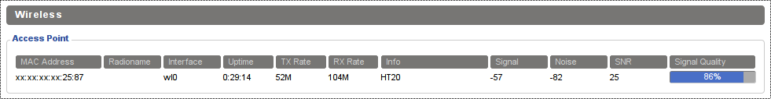
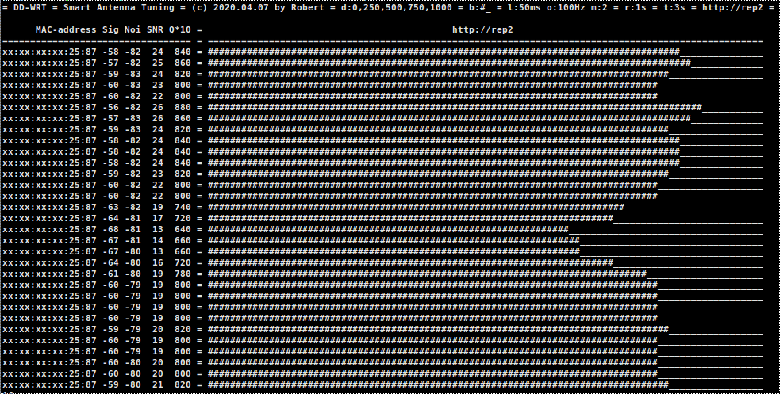

# dd-wrt-tools

Various command line CLI tools related to DD-WRT but intended for use on linux desktop (console).

scripts:

* [smantun](bin/smantun.sh "Tools for Tuning the Antenna")  - Smart Antenna Tuning tool for linux CLI
* [aaping](bin/aaping.sh "ASUS audible ping") - ASUS audible ping for linux CLI
* colog - colorize and enrich dd-wrt remote log file

---

# smantun = sma-ant-tun = smart antenna tuning

CLI (console) script to display client wifi parameters (Signal dBm, Noise floor dBm, SNR ratio, Quality) and semi-graphical 
signal quality bar plot as well as audible beeping (with pitch related to signal Quality). Many
configurable options (with sensible default values) are useful for adjusting the antenna / router / client
position to maximize wireless signal quality (coverage). 

To get usage help simply run the script without any parameter:

    $ bin/smantun.sh
    
    = DD-WRT = Smart Antenna Tuning = (c) 2020.06.01 by Robert =
    
    usage: smantun.sh [-v] [-a mac] [-s 'c1,c2'] [-b 'xX'] [-l ms] [-o Hz] [-m k] [-r sec] [-d] ['q10,q10']] [-t sec] [router]
    
    -v             ... verbose (debug) mode
    -a|mac mac     ... filter only MAc address (case insensitive, partial match supported, watch out for masking MAC addr.)
    -s[tats] c1,c2 ... display statistics (comma separated 3-char column names, default: mac,sig,noi,snr,q10)
                       mac = MAC address
                       sig = Signal dBm
                       noi = Noise dBm
                       snr = Signal to Noise Ratio
                       q10 = Quality percent * 10
    -b[ar]         ... bar plot characters (default '#_', set to '' to disable plot)
    -l[en]         ... beep length in ms (default 50, set to 0 to disable beeping)
    -o[ffset]      ... the lowest beep (offset) in Hz (default 100)
    -m[ult]        ... beep frequency multiplication (sensitivity) factor (default 2)
    -r[efresh]     ... update frequency in seconds, float accepted (default 3)
    -d[emo]        ... demonstration mode (comma separated Q10 values, default '0,250,500,750,1000')
    -t[imeout]     ... router connection timeout in sec (default 3)
    router         ... router/host as target client running DD-WRT with accessible info page (hostname or ip address)
    
    Note: the beep freq. formula (Q is the signal quality between 0..100): frequency = mult x Q*10 + offset [Hz]
    
    This script will display statistics, plot signal level (text-mode) and trigger audible beep reflecting signal quality.
    This is very useful for router antenna adjustment as you don't need to watch the screen, just listen to the beeps.
    The sound is generated by PC-SPEAKER. Make sure it is connected and functional.
    
    Use demo mode to verify you can hear the beeping sound from your PC-SPEAKER clearly:
    
    > smantun.sh -d
    
    > smantun.sh -d '500,1000'
    
    To supress bar plot just assign empty string to -b[ar] parameter:
    
    > smantun.sh -b '' router
    
    To execute demo and real signal plot:
    
    > smantun.sh -d router
    
    Quick (low precision) adjustment (refresh 0.5 sec):
    
    > smantun.sh -r 0.5 router
    
    To suppress audible beeps (silent execution) just set beep length to 0:
    
    > smantun.sh -l 0 router
    
    Display only Q10 and SNR statistics columns:
    
    > smantun.sh -s q10,snr 0 router
    
    Filter only MAC XX:XX:XX:XX:56:78
    
    > smantun.sh -mac xx:56:78 router
    
    This script executes infinite loop so use standard CTRL-C to stop and return to the command prompt.
    
    REQUIRES:
    - kernel module [ pcspkr ] (usually blackisted and not loaded so script will load module at the startup if required)
    - connected and functional PC-SPEAKER
    - beep executable
    - wget, grep, awk
    - dd-wrt running on the target router (connected to the access point)
    
    The script does not make any changes to your system configuration. It loads kernel module [ pcspkr ] temporarily till the next reboot.
    The kernel module stays loaded after the script has been ended so if you experience any [ pcspkr ] related problems
    you might try to remove kernel module [ pcspkr ] manually by:
    
    > sudo rmmod pcspkr
    
    Tips:
    - for quick antenna adjustment use fast refresh, but be aware that you are affecting the signal by your presence
    - for high precision adjustment use slower refresh and always distance yourself from antenna after manipulation
    - you can adjust multiplication factor for increased sensitivity, higher value will trigger bigger pitch change
    - wifi card in your router needs some time to settle down so be smart with refresh speed
    
### smantun - dd-wrt
   
The wireless parameters are from DD-WRT info page - section Wireless - Clients or Access Point.
This script will help to adjust antenna and position of the wireless AP and clients.
You can connect remotely to the router to monitor Q (quality) of the client to AP wifi connection.
To monitor AP to client Quality you can setup temporary auxiliary router with dd-wrt as a client
and position it at the client location. In this case you connect to auxiliary router to monitor
AP to client wireless signal quality and perform antenna adjustments. You get the idea ...  

    Note: DD-WRT is using Q!0 as parameter for quality, which is just 10 * Q. 
    So when quality is 0..100% the 10x multiplication Q10 is 0..1000.
 
The Signal Quality Q is internally processed by DD-WRT and it is build version dependent.
So the same SNR (signal-to-noise-ratio) value will display different quality Q in different
dd-wrt build. This might be caused by various factors like different wifi
drivers so don't get obsessed with absolute number, just look for relative changes (Q dropping vs Q rising). 

### smantun - implementation

The simplified workflow:
* the required kernel module is loaded if needed 
* the html page is retrieved by wget and java script function call setWirelessTable() is filtered out
* numerical parameter Signal [dBm], Noise [dBm], SNR, Q10 [%] are extracted from JS setWirelessTable() call
* values are diplayed as numbers in columns: MAC address, Signal, Noise, SNR, Q10
* optional signal plot bar is displayed with fixed width 100 chars (1 char = 1 %)
* optional audible beep is generated through PC speaker
* loop forever (until CTRL+C)

_click on the screenshot image to play the screenrecording video_

_click on the screenshot image to play the screenrecording video_

### smantun - ideas for possible future improvements

* ANSI colors
* console auto-scaling (columns, width)
* PyQt graphical GUI
* sound generated by sound system (and not PC speaker, then kernel module will not be required)
* optional history
* systray icon

---

# aaping = audible asus ping

ASUS audible ping provides audible feedback of target router. It is well know that ASUS returns different TTL
in normal operating mode (TTL=64) or in recovery / tftp mode (TTL=100). By using this aaping you can easily
hear distinct audible beep for each mode and immediatly know the state of target router.

I found this usefull in case of manually resetting or entering recovery mode for router by pressing reset / wds
buttons and power cycling. This helps when flashing experimental / beta versions of dd-wrt / tomato usb etc.

To get usage help simply run the script without any parameter:

    $ bin/aaping.sh
    
    = Audible-Asus-PING = (c) 2020.06.27 by Robert =
    
    usage: aaping.sh [-v][-aa 'ttL:mode:hz:ms ttl2:mode2:hz2:m2 *:mode3:hz3:ms3'][-scroll mode][-timestamp frm][-silent][-c count][-i interval][ping_opt] target
    
    -v               ... verbose (debug) mode
    -aa ttl=xx:mode:hz:ms ... audible settings where xx is the ttl to match to generate beep with frequency of hz Hz and
                              length of ms ms to pc speaker. Mode is descriptive information about mode (do not use spaces,
                              use _ in text, all undescores will be displayed as spaces). Multiple entries are separated by space,
                              the last entry should match all (* this will beep in case of any error). To make specific entry silent
                              use empty Hz and ms like ttl=123:no_sound_for_this_ttl:::
                              Default lookup table is:
                              ttl=64:Normal:1000:50 ttl=100:TFTP_Recovery:500:100 ttl=63:Normal/L-1:900:50 ttl=99:TFTP_Recovery/L-1:400:100 *:no_response_?:200:100
    -scroll mode     ... activate scroll mode (default err, useful to see error distribution history), mode is:
                         all = always scroll with each ping
                         no  = never scroll, keep output limited to one-line
                         err = only scroll errors
                         anything else will keep default value (err) unchanged
    -timestamp frm   ... timestamping output, frm is date format or yes or no:
                         yes = use default format (%x %X), use if you want to be explicit
                         no  = no timestamps
                         frm = valid date format string, see man date for details
                         invalid string (without %) is treated as no timestamping
    -silent          ... activate globally silent mode despite lookup table, only display output, no audible sound (default audible mode)
    -c count         ... limit to count, stop after executing count pings (default 0 = infinite loop)
    -i interval      ... wait interval between sending the packets (default each 1s)
    ping_opt         ... other ping options pass-through to ping
    target           ... target (hostname or ip address)
    
    > aaping.sh target
    
    This will execute infinite loop so use standard CTRL-C to stop and return to the command prompt.
    
    > aaping.sh -silent -scroll all -count 100 -s 12345 target
    
    This will execute only 100 pings with packet size of 12345 in silent mode and scrolling everything output.
    
    REQUIRES (only in audible mode):
    - kernel module [ pcspkr ] (usually blackisted and not loaded so script will load module at the startup if required)
    - connected and functional PC-SPEAKER
    - beep executable
    
    The script does not make any changes to your system configuration. It loads kernel module [ pcspkr ] temporarily till the next reboot.
    The kernel module stays loaded after the script has been ended so if you experience any [ pcspkr ] related problems
    you might try to remove kernel module [ pcspkr ] manually by:
    
    > sudo rmmod pcspkr
    
    NOTE:  default lookuo table TTL_MODE_HZ_MS is very ASUS centric. For diffenet manufacturer you have to find out
    proper TTL responses and build your lookup table. My entire network runs exclusively on ASUS routers only ...
    
